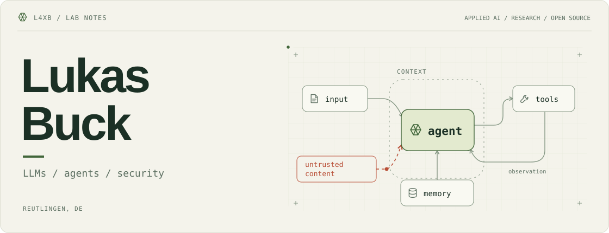

<!-- GitHub profile README. Upload this file AND the assets/ folder to the repository root. -->

<picture>
  <source media="(max-width: 640px) and (prefers-color-scheme: dark)" srcset="assets/lab-notes/header-mobile-dark.svg" />
  <source media="(max-width: 640px) and (prefers-color-scheme: light)" srcset="assets/lab-notes/header-mobile-light.svg" />
  <source media="(prefers-color-scheme: dark)" srcset="assets/lab-notes/header-dark.svg" />
  
</picture>

<p>
  <a href="https://www.linkedin.com/in/lukas-buck-664384237/"></a>
  <a href="https://www.researchgate.net/profile/Lukas-Buck"></a>
  <a href="mailto:Lukas.Buck@Student.Reutlingen-University.de"></a>
</p>


<br/>

##  current research updates

> **Can LLMs Chain Bugs into Breaches?**  
> Attack Path Discovery in Terraform.  
> <sub>IEEE ICSME 2026 · Visions and Emerging Results · Accepted, to appear.</sub>

<br/>

##  patch log

A few merged fixes to AI tooling, shown as before/after notes:

**claude-mem** · [#3949 ↗](https://github.com/thedotmack/claude-mem/pull/3949)

```diff
- Failed memory writes could get skipped forever.
+ Keep failed observations pending.
```

**omlx** · [#3545 ↗](https://github.com/jundot/omlx/pull/3545)

```diff
- Embedding responses could contain NaN / Inf.
+ Reject non-finite embeddings.
```

**Logfire** · [#2404 ↗](https://github.com/pydantic/logfire/pull/2404)

```diff
- Exporter failures could deadlock logging.
+ Use a re-entrant lock.
```

<br/>

[All merged pull requests ↗](https://github.com/search?q=author%3AL4XB+is%3Apr+is%3Amerged&type=pullrequests)

---

<p align="center">
  <sub>This is a README, not a system prompt.</sub>
</p>
